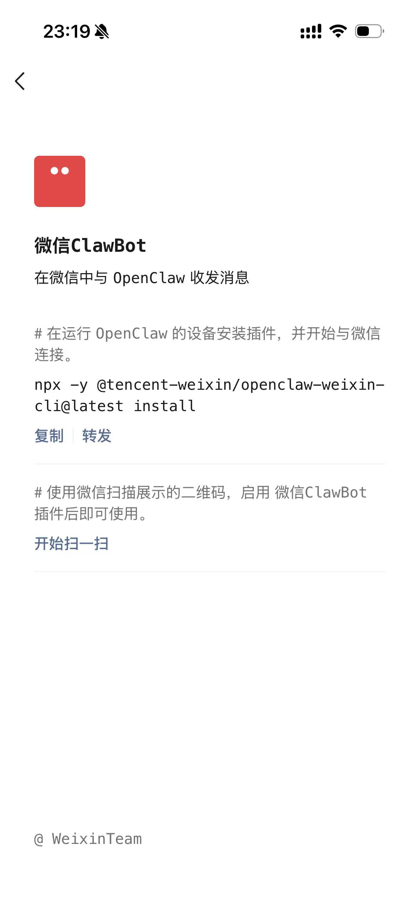
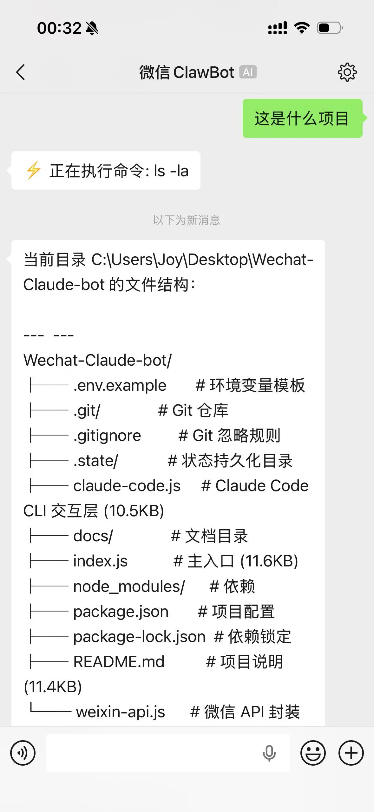

# WeChat Claude Code Bot

<p align="center">
  
  
</p>

<p align="center">
  <strong>Contrôlez votre Claude Code CLI local à distance via WeChat — gérez vos projets de code à tout moment, n'importe où</strong>
</p>

<p align="center">
  <a href="../../README.md">中文</a> · <a href="README_EN.md">English</a> · <a href="README_JA.md">日本語</a> · <a href="README_KO.md">한국어</a> · <a href="README_RU.md">Русский</a> · <a href="README_ES.md">Español</a> · <a href="README_FR.md">Français</a> · <a href="README_DE.md">Deutsch</a> · <a href="README_PT.md">Português</a> · <a href="README_AR.md">العربية</a>
</p>

<p align="center">
  L'utilisateur envoie un message sur WeChat → Claude Code local traite → Retour en temps réel sur WeChat
</p>

---

## Table des matières

- [Fonctionnalités](#fonctionnalités)
- [Comparaison avec OpenClaw direct](#comparaison-avec-openclaw-direct)
- [Connexion WeChat](#connexion-wechat)
- [Comment ça marche](#comment-ça-marche)
- [Démarrage rapide](#démarrage-rapide)
- [Configuration](#configuration)
- [Guide d'utilisation](#guide-dutilisation)
- [Cas d'utilisation](#cas-dutilisation)
- [Liste des commandes](#liste-des-commandes)
- [Structure du projet](#structure-du-projet)
- [FAQ](#faq)

---

## Fonctionnalités

### Capacités principales

- **Contrôle distant via WeChat** — Contrôlez votre Claude Code local directement via les messages WeChat, sans ouvrir de terminal
- **Fonctionne après fermeture de WeChat** — Grâce au long polling côté serveur, les messages sont mis en file d'attente même après la fermeture de l'app WeChat. Rouvrez WeChat pour voir les réponses — le Bot fonctionne 24h/24, 7j/7
- **Contrôle complet de l'ordinateur** — Claude Code peut réellement opérer votre ordinateur : lire/écrire des fichiers, exécuter des commandes, chercher du code, installer des paquets, opérations Git — pas juste du chat
- **Opère sur de vrais projets** — Claude Code s'exécute dans votre répertoire de projet local, modifie directement les vrais fichiers de code

### Expérience utilisateur

- **Progression en temps réel** — Mises à jour en direct dans WeChat pendant que Claude Code travaille (ex : `📖 Lecture du fichier: src/app.js`)
- **Indicateur de frappe** — Affiche le statut « en train d'écrire » dans WeChat pendant le traitement
- **Division intelligente** — Les longues réponses sont divisées aux limites des blocs de code avec numérotation
- **Conversion Markdown** — Conversion automatique du Markdown en texte compatible WeChat
- **Messages vocaux** — Support de la voix-vers-texte WeChat, envoyez des commandes par voix
- **Commandes slash** — `/new` réinitialiser, `/status` statut, `/help` aide

### Stabilité et sécurité

- **Isolation des sessions** — Chaque utilisateur a une session indépendante avec contexte continu
- **Contrôle de concurrence** — Jusqu'à 3 tâches simultanées, excédent en file d'attente
- **Reconnexion automatique** — Réauthentification automatique à l'expiration de session
- **Nettoyage des sessions** — Sessions inactives nettoyées après 1h, max 100 sessions
- **Protection timeout étagée** — Rappel à 2 min, arrêt forcé à 5 min
- **Arrêt propre** — Ctrl+C avec nettoyage automatique des processus enfants
- **Exécution locale** — Code et données ne passent jamais par des serveurs tiers

---

## Comparaison avec OpenClaw direct

L'OpenClaw officiel (ClawBot) de WeChat permet de discuter avec une IA dans WeChat. Ce projet connecte **Claude Code CLI** par-dessus, apportant des différences fondamentales :

| Dimension | OpenClaw direct | Ce projet (WeChat Claude Code Bot) |
|-----------|----------------|-------------------------------------|
| **Capacités** | Chat texte uniquement | Contrôle total : lecture/écriture de fichiers, exécution de commandes |
| **Coût en tokens** | Consomme des tokens API par conversation | Utilise Claude Code CLI local, inclus dans l'abonnement — sans tokens supplémentaires |
| **Accès projet** | Pas d'accès aux fichiers locaux | Opère directement sur votre vrai code |
| **Exécution de commandes** | Non supporté | Toute commande terminal (npm, git, docker, etc.) |
| **Contexte** | Texte du chat uniquement | Tout le répertoire projet comme contexte |
| **Outils** | Aucun | 10+ outils intégrés : Read, Write, Edit, Bash, Glob, Grep, WebSearch, etc. |
| **Progression** | Aucune | Progression en temps réel de chaque opération |
| **Opérations Git** | Non supporté | Commit, push, créer des branches directement |
| **Installation de paquets** | Non supporté | `npm install`, `pip install`, etc. |
| **Multi-tours** | Contexte limité | Gestion de sessions indépendante avec contexte persistant |

### En une phrase

> **OpenClaw direct** = Discuter avec une IA dans WeChat
>
> **Ce projet** = Contrôler à distance un programmeur IA qui lit/écrit du code, exécute des commandes et gère vos projets

---

## Connexion WeChat

Ce projet utilise le protocole officiel WeChat **iLink Bot** (ClawBot), connexion par scan de code QR :

<p align="center">
  
</p>

<p align="center">
  
</p>

> À gauche : page officielle du plugin ClawBot de WeChat. À droite : utilisation réelle. Après le démarrage du Bot, un code QR apparaît dans le terminal — scannez-le avec WeChat pour vous connecter. Une fois connecté, le Bot continue de fonctionner et traiter les messages même après la fermeture de WeChat. Rouvrez WeChat pour voir les réponses.

---

## Comment ça marche

```
┌──────────┐         ┌──────────────────┐         ┌───────────┐
│  WeChat   │ ─msg──▶│  iLink Bot API   │ ─poll──▶│ Bot local │
│(téléphone)│ ◀rép.──│ (weixin.qq.com)  │ ◀envoi─ │ (Node.js) │
└──────────┘         └──────────────────┘         └─────┬─────┘
                                                        │
                                                        │ Appel CLI
                                                        ▼
                                                  ┌───────────┐
                                                  │ Claude Code│
                                                  │  (local)   │
                                                  └───────────┘
```

1. Le Bot reçoit les messages via WeChat iLink Bot API (long polling)
2. Transfère les messages au Claude Code CLI local (mode stream-json)
3. Analyse en temps réel les appels d'outils de Claude Code, envoyant la progression à WeChat
4. Une fois terminé, formate et envoie le résultat final à WeChat

---

## Démarrage rapide

### Prérequis

- **Node.js** >= 18
- **Claude Code CLI** installé globalement (`npm install -g @anthropic-ai/claude-code`)
- **Compte WeChat**

### Installation

```bash
# 1. Cloner le dépôt
git clone https://github.com/mrliuzhiyu/Wechat-Claude-bot.git
cd Wechat-Claude-bot

# 2. Installer les dépendances
npm install

# 3. (Optionnel) Configurer le répertoire de travail
cp .env.example .env
# Éditez .env pour définir CLAUDE_CWD avec le chemin de votre projet

# 4. Démarrer le Bot
npm start
```

### Première connexion

1. Après le démarrage, un code QR s'affiche dans le terminal
2. Ouvrez WeChat → Scannez le code QR
3. Confirmez la connexion dans WeChat
4. Quand vous voyez `✅ Connecté !`, le bot est prêt
5. Envoyez un message au Bot dans WeChat pour commencer

> Après la première connexion, le token est sauvegardé automatiquement. Pas besoin de rescanner au prochain démarrage (sauf si le token expire).

---

## Configuration

Configurez via le fichier `.env` ou les variables d'environnement :

| Variable | Description | Par défaut |
|----------|-------------|------------|
| `CLAUDE_CWD` | Répertoire de travail de Claude Code | Répertoire courant (`process.cwd()`) |
| `SYSTEM_PROMPT` | Prompt système additionnel | Vide |

**Exemple de fichier `.env` :**

```bash
# Spécifier le répertoire du projet pour Claude Code
CLAUDE_CWD=/home/user/my-project

# Prompt système personnalisé (optionnel)
SYSTEM_PROMPT=Vous êtes un assistant spécialisé en développement React
```

---

## Guide d'utilisation

### Utilisation basique

Envoyez des messages en langage naturel dans WeChat décrivant vos besoins. Claude Code les exécutera automatiquement :

```
Vous: Montre-moi la structure du projet
Bot: 🤖 Reçu, traitement en cours...
Bot: 🔍 Recherche de fichiers: **/*
Bot: Structure du projet :
     ├── src/
     │   ├── components/
     │   ├── pages/
     │   └── utils/
     ├── package.json
     └── README.md
```

### Ce que Claude Code peut faire

Via les messages WeChat, vous pouvez demander à Claude Code de :

- **Lire du code** — « Montre-moi le contenu de src/app.js »
- **Écrire du code** — « Crée une fonction de formatage de date dans utils »
- **Modifier du code** — « Change la couleur de fond du composant App en bleu »
- **Exécuter des commandes** — « Lance npm test et montre-moi les résultats »
- **Rechercher du code** — « Trouve tous les endroits qui utilisent useState »
- **Installer des paquets** — « Installe axios et lodash »
- **Déboguer** — « Pourquoi la compilation échoue ? Vérifie »
- **Revue de code** — « Vérifie les changements récents pour d'éventuels problèmes »
- **Opérations Git** — « Fais un commit avec le message 'fix: corriger le bug de login' »

### Progression en temps réel

Quand Claude Code effectue des opérations, vous recevez des mises à jour :

```
📖 Lecture du fichier: src/app.js
✏️ Édition du fichier: src/utils.js
⚡ Exécution de commande: npm test
🔍 Recherche de fichiers: **/*.ts
🔍 Recherche de contenu: handleClick
📝 Création du fichier: src/helper.js
📋 Planification des tâches
```

### Gestion des longs messages

Quand la réponse de Claude Code dépasse 4000 caractères, les messages sont divisés intelligemment :

- Priorité à la division aux limites des blocs de code
- Puis aux lignes vides
- Chaque fragment est étiqueté, ex : `(suite 2/3)`

---

## Cas d'utilisation

### Cas 1 : Corriger un bug pendant le trajet

> Un collègue signale un bug urgent en production alors que vous êtes dans le métro.

```
Vous: Montre-moi la fonction login dans src/api/auth.js
Bot: [affiche le code]

Vous: La validation du token à la ligne 42 est incorrecte, ça devrait être > pas >=
Bot: ✏️ Édition du fichier: api/auth.js
Bot: Corrigé, >= changé en >

Vous: Lance les tests
Bot: ⚡ Exécution: npm test
Bot: Les 23 tests passent ✓

Vous: Fais un commit "fix: corriger la condition limite d'expiration du token"
Bot: Commité et poussé vers le dépôt distant
```

### Cas 2 : Développer sur mobile

> C'est le week-end, vous avez une idée de fonctionnalité.

```
Vous: Crée un composant ThemeToggle dans src/components avec mode sombre/clair
Bot: 📝 Création: components/ThemeToggle.jsx
Bot: ✏️ Édition: App.jsx
Bot: Composant ThemeToggle créé et importé dans App.jsx...
```

### Cas 3 : Revue de code et apprentissage

> Vous rejoignez un nouveau projet et voulez comprendre rapidement la base de code.

```
Vous: Quelle est l'architecture globale de ce projet ?
Bot: [analyse la structure, les modules principaux, la stack technique...]

Vous: Où se trouve la logique de connexion à la base de données ?
Bot: 🔍 Recherche: database|connection|mongoose
Bot: La connexion à la BDD se trouve dans src/config/db.js...
```

### Cas 4 : DevOps et monitoring

> Vous devez vérifier l'état du service en déplacement.

```
Vous: Vérifie l'état des conteneurs Docker
Bot: ⚡ Exécution: docker ps
Bot: [affiche la liste des conteneurs...]

Vous: Vérifie les logs récents pour des erreurs
Bot: ⚡ Exécution: docker logs --tail 50 my-app
Bot: [affiche les logs...]
```

---

## Liste des commandes

| Commande | Description |
|----------|-------------|
| `/help` | Afficher l'aide |
| `/new` | Réinitialiser la conversation, démarrer une nouvelle session |
| `/status` | Voir le statut du Bot (version, uptime, répertoire de travail) |

> Tous les messages sauf les commandes slash sont envoyés à Claude Code pour traitement.

---

## Structure du projet

```
Wechat-Claude-bot/
├── index.js          # Point d'entrée : routage des messages, commandes slash, conversion Markdown
├── weixin-api.js     # Wrapper WeChat iLink Bot API : login, messagerie, indicateur de frappe
├── claude-code.js    # Interaction Claude Code CLI : gestion de sessions, parsing de flux, callbacks de progression
├── package.json
├── .env.example      # Exemple de variables d'environnement
├── .gitignore
├── docs/             # Documentation multilingue et ressources
│   ├── images/       # Ressources images
│   └── README_*.md   # Traductions
└── .state/           # (généré à l'exécution) Identifiants et état de synchronisation
```

---

## FAQ

### Q : « commande claude introuvable » au démarrage

Assurez-vous que Claude Code CLI est installé globalement :

```bash
npm install -g @anthropic-ai/claude-code
```

Vérifiez avec `claude --version`.

### Q : Le code QR ne s'affiche pas correctement

Si votre terminal ne supporte pas Unicode, le code QR peut ne pas s'afficher correctement. Le log de démarrage contient une URL — ouvrez-la dans un navigateur pour scanner.

### Q : Que faire si le token expire ?

Le bot détecte automatiquement l'expiration du token et affiche un nouveau code QR. Aucune action manuelle nécessaire.

### Q : Plusieurs personnes peuvent-elles l'utiliser simultanément ?

Oui. Chaque utilisateur WeChat a une session indépendante. Jusqu'à 3 requêtes simultanées sont supportées ; les autres sont automatiquement mises en file d'attente.

### Q : La requête a expiré

Le timeout par défaut est de 5 minutes par requête. Pour les tâches complexes, divisez-les en étapes plus petites — par exemple, demandez d'abord à Claude d'explorer la structure du projet, puis effectuez des opérations spécifiques.

### Q : Les images/fichiers sont-ils supportés ?

Actuellement, seuls les messages texte et vocaux (avec conversion en texte activée) sont supportés. Les images, vidéos et fichiers ne sont pas encore supportés.

### Q : Quelle est la sécurité ?

- Le bot s'exécute localement sur votre machine — le code ne passe jamais par des serveurs tiers
- Claude Code s'exécute en mode `bypassPermissions` avec accès complet aux fichiers et commandes
- Les identifiants sont stockés localement dans `.state/` avec des permissions propriétaire uniquement
- `.env` est dans `.gitignore` et ne sera pas commité dans Git

> **Attention** : Claude Code ayant des permissions complètes, assurez-vous que seules des personnes de confiance peuvent envoyer des messages au Bot.

---

## License

MIT
